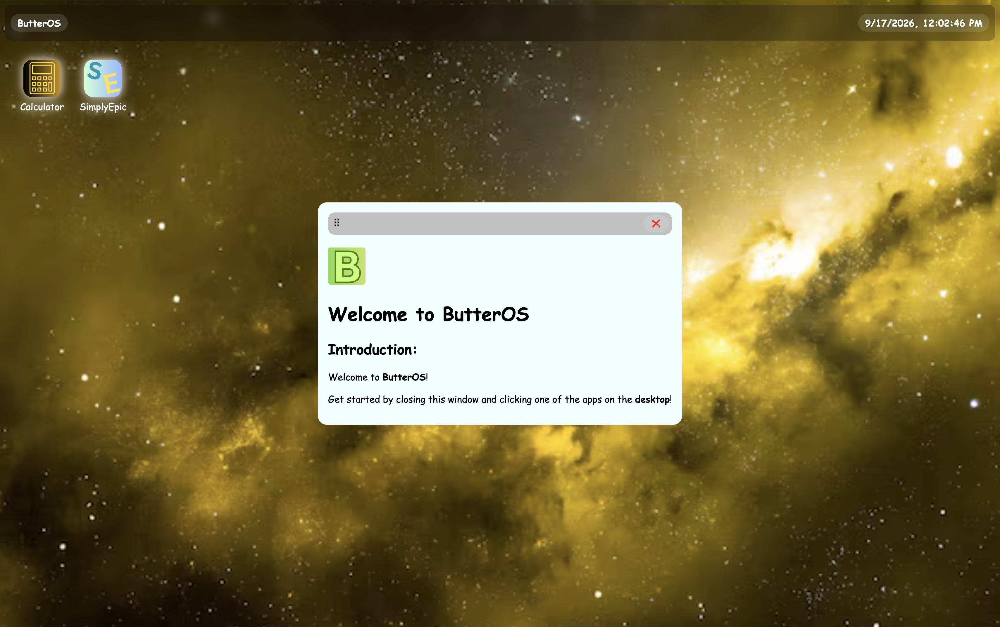
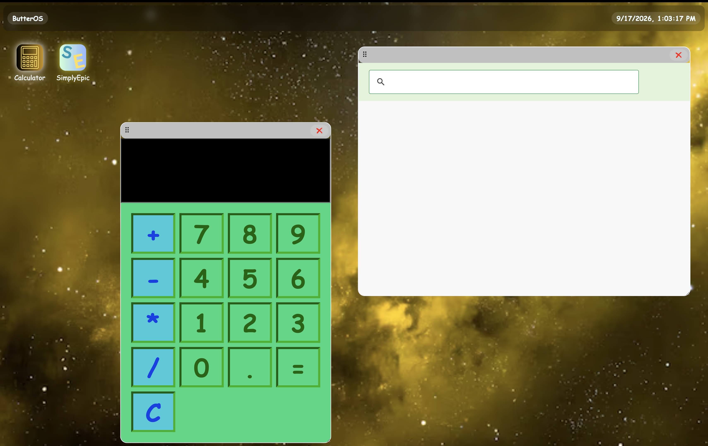
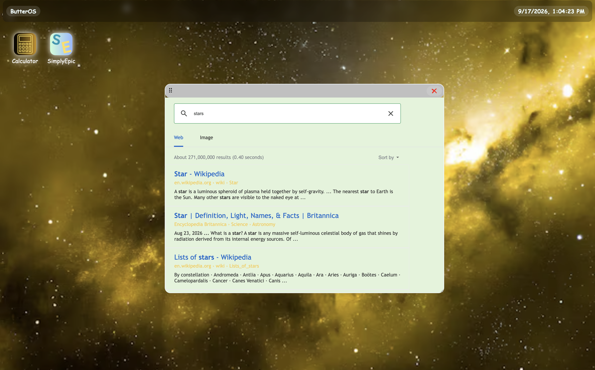
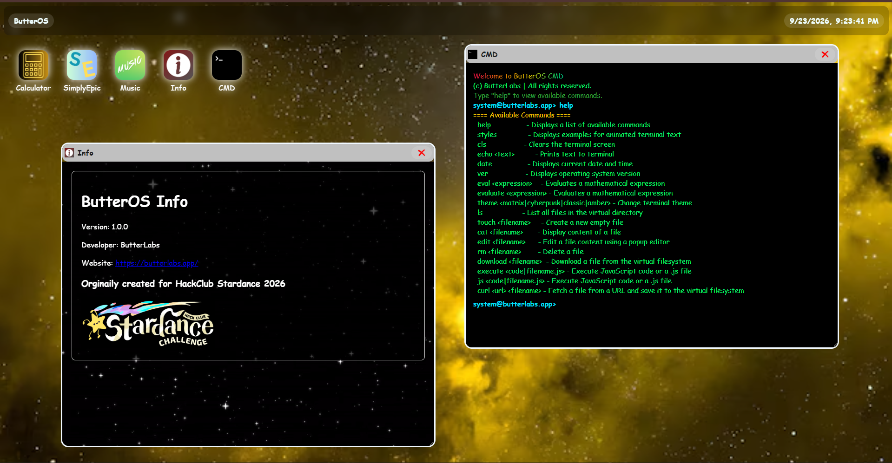
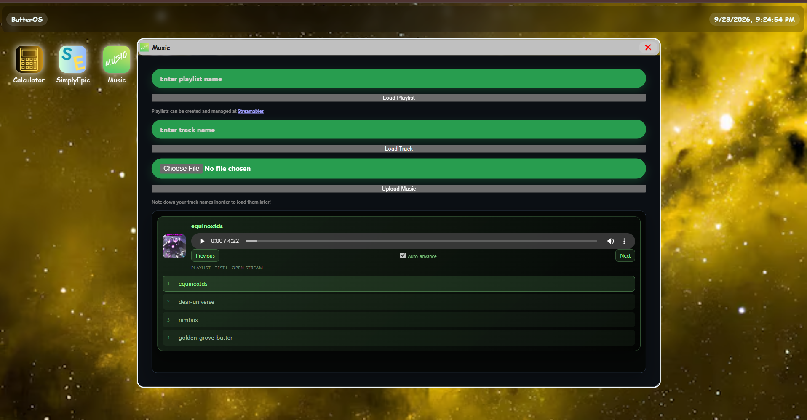
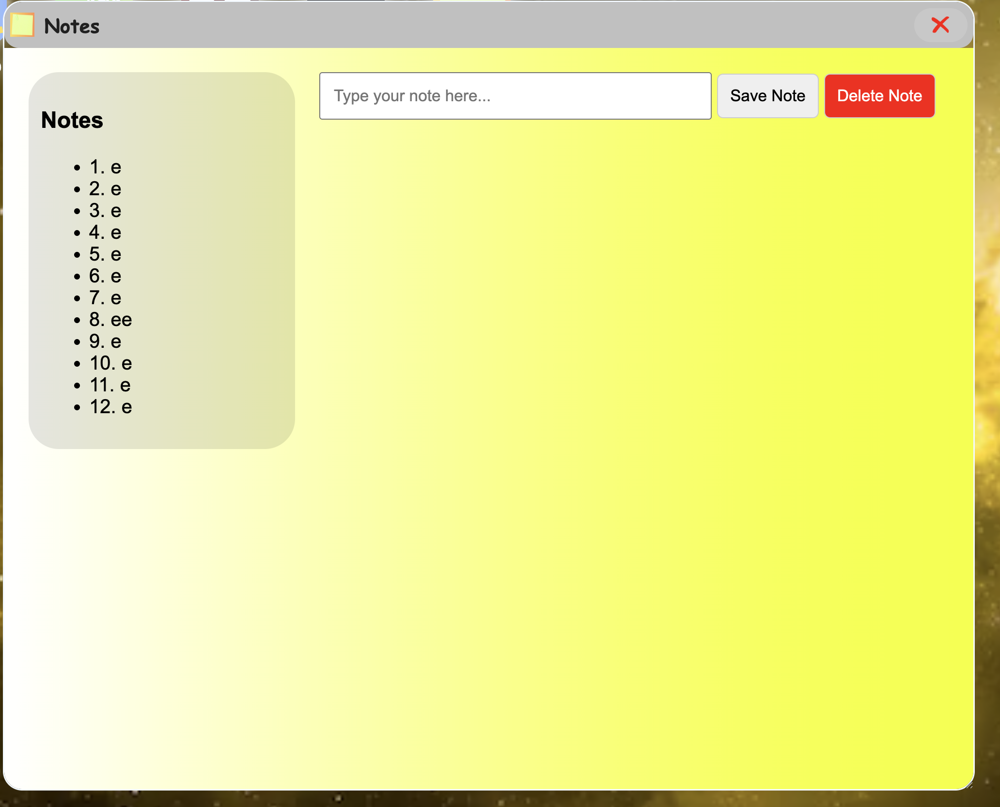

# ButterOS

An interactive web opertating system running via html and css with cool apps and features!

## Test it Out
[Click here](http://butteros.butterlabs.app/)
### Requirements
 - A hosting provider or a server to host the website, thats it!

### Prerequisites
A working server with static html/css/js support
(Recommnded to use github/cloudflare pages)

## How it Works
The website/WebOS is powered by 2 key components, the windowdrag and appopen script files. whenever you click on a app button, it uses a function to change the display property for all windows to show them. All windows are loaded by defualt when you launch the page!

## Apps
This WebOS currently features `6` apps:
 - `Calculator` - Calculates stuff 
 - `SimplyEpic` - Google search but no ai and only searches academic sites (3 to be exact)
 - `ButterOS Music` - Cloud based music app
 - `Info` - Returns info about the project
 - `CMD` - The butterOS command line
 - `Notes` - The butterOS notes app

## Future Plans
 - Remake the toolbar from scratch because its not much different from the guide
 - add support for connecting to other butterlabs services 
 - Add a notepad app
 - add a working timer app
 - add a pong app/game
 - add some more apps in general because it kind of feels empty
 - revamp the design 
 - add a file system app that connects to the file system in the cmd
 - fix the bugs mentioned in the ratings on stardance
## Credits
  - Special thanks to [Brocode](https://youtu.be/I5kj-YsmWjM) for the calculator guide!
  - Special thanks to [this](https://jams.hackclub.com/batch/webOS) guide for the basic guide on making the toolbar and windows (however the app system and window open/close were made custom by me) 
  - HUGE thanks to [this github project](https://github.com/nploc1209/TeXpress/blob/main/README.md) for helping me model my readme

## Important Links
 - [Stardance project](https://stardance.hackclub.com/projects/61558)
## AI Usage
 - mostly vs code autofill
 - calculator css
 - terminal file system
## Gallery

# This website was made for HackClub Stardance 2026
